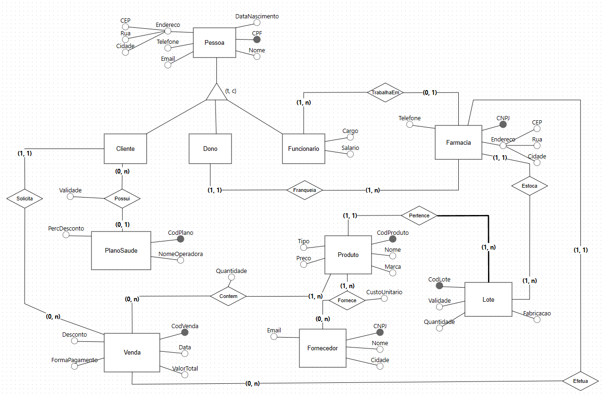

# Pharmacy chain Database

### About
This is a database schema for MySQL/MariaDB designed for a pharmacy chain.  
It manages people, health insurance, franchises, sales, products, suppliers and stock control.

### Database Relationship Model

Pessoa = {**CPF**, DataNascimento, Nome, Email, Telefone, CEP, Rua, Cidade}  
Cliente = {**CPF (PK e FK de Pessoa)**, _CodPlano (FK de PlanoSaude)_, ValidadePlano}  
Dono = {**CPF (PK e FK de Pessoa)**}  
Farmacia = {**CNPJ**, _CPF (FK de Dono)_, CEP, Rua, Cidade, Telefone}  
Funcionario = {**CPF (PK e FK de Pessoa)**, _CNPJ (FK de Farmacia_), Cargo, Salario}  
PlanoSaude = {**CodPlano**, PercDesconto, NomeOperadora}  
Venda = {**CodVenda**, _CPF (FK de Cliente)_, _CNPJ (FK de Farmacia)_, Desconto, FormaPagamento, Data, ValorTotal}  
Produto = {**CodProduto**, Nome, Marca, Tipo, Preco}  
Fornecedor = {**CNPJFornecedor**, Nome, Cidade, Email}  
Forne_Prod = {**CodProduto (PK e FK de Produto)**, **CNPJFornecedor (PK e FK de Fornecedor)**, CustoUnitario}  
Venda_Prod = {**CodVenda (PK e FK de Venda)**, **CodProduto (PK e FK de Produto)**, Quantidade}  
Lote = {**CodLote**,  **CodProduto (PK e FK de Produto)**, _CNPJ (FK de Farmacia)_, Validade, Quantidade, DataFabricacao}  

### Database Entity-relationship Model

### To-do
- Translate database to English
- Database creation Bash script
